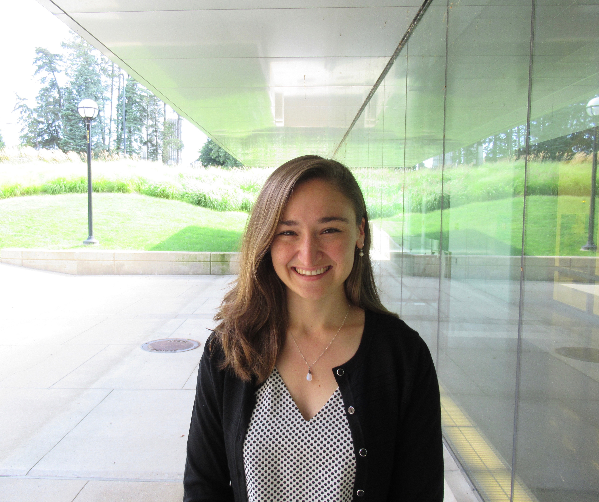
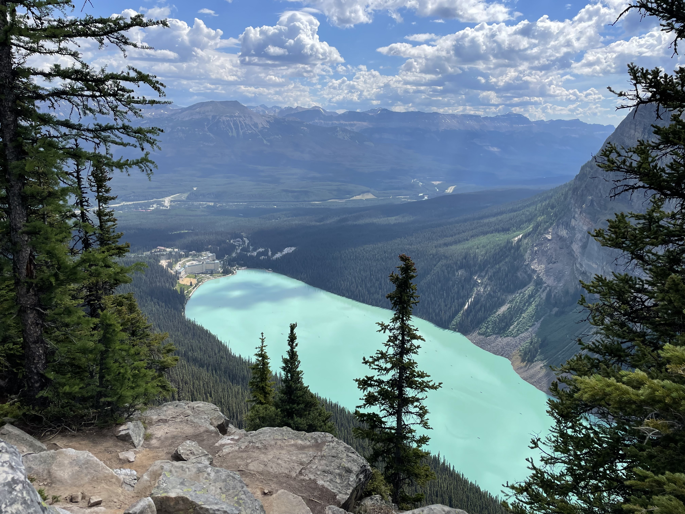
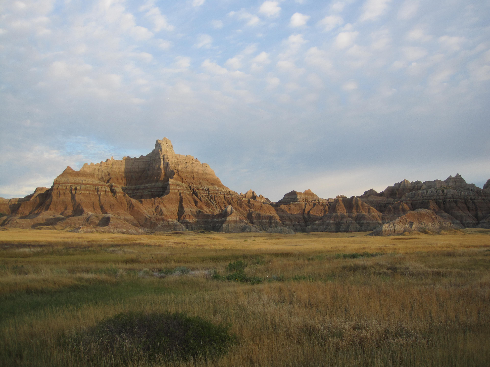
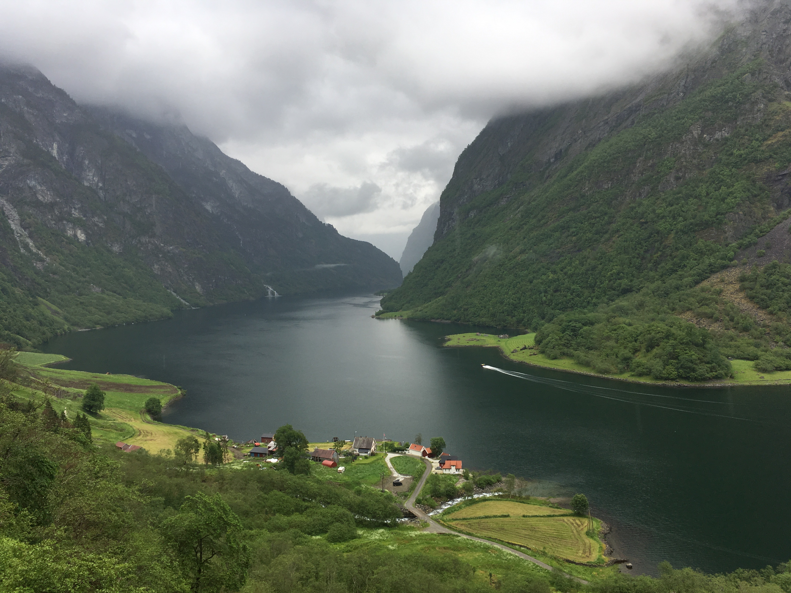
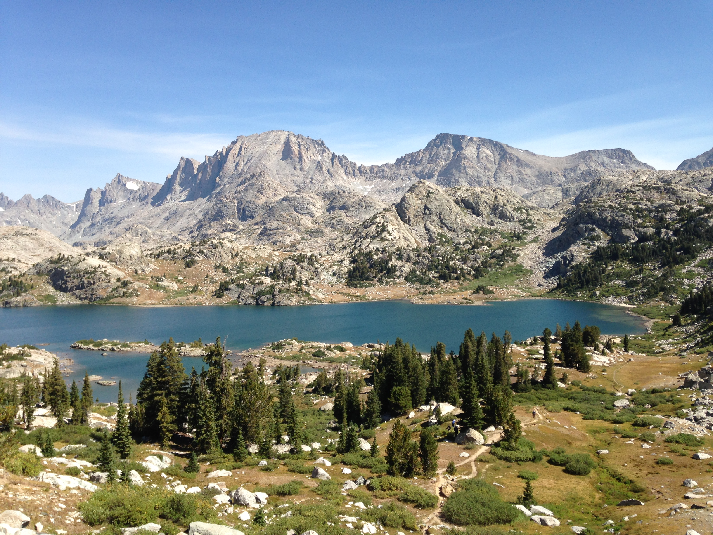
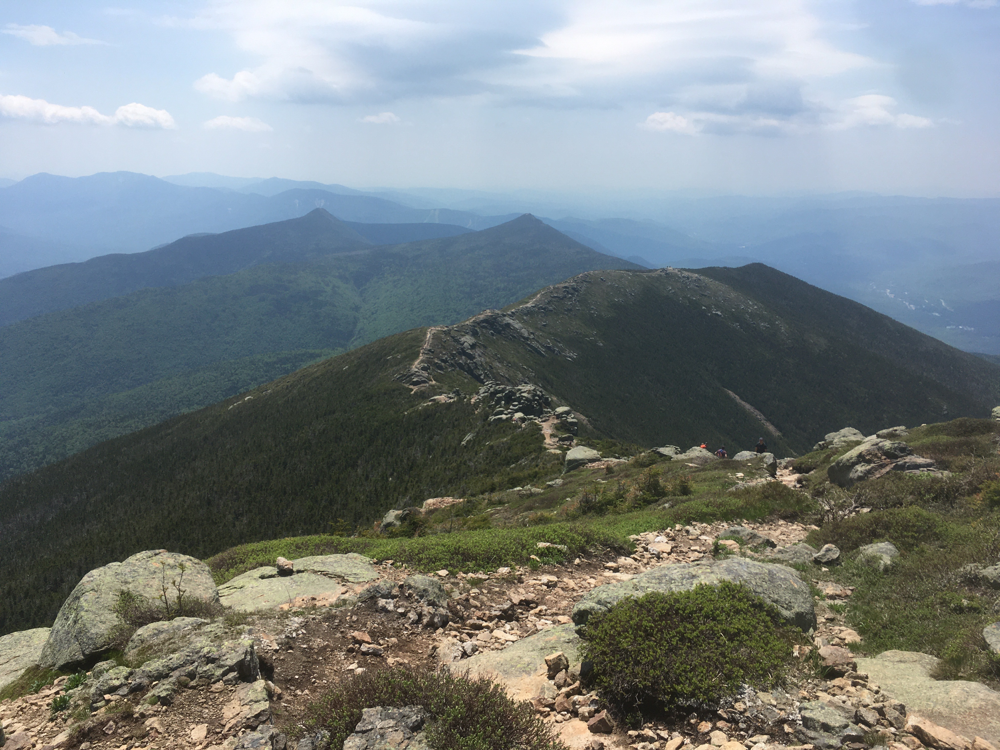

---
#
# By default, content added below the "---" mark will appear in the home page
# between the top bar and the list of recent posts.
# To change the home page layout, edit the _layouts/home.html file.
# See: https://jekyllrb.com/docs/themes/#overriding-theme-defaults
#
layout: home
---

I am a Maria Goeppert Mayer Postdoctoral Fellow at [Argonne National Laboratory](https://www.anl.gov/) in Lemont, Illinois in the Energy Systems and Infrastructure Analysis Division. My research focuses on developing control and optimization algorithms for power and energy systems. I received my Ph.D. in Electrical Engineering from the University of Michigan in Ann Arbor in 2019, where my thesis was on developing control systems for self-powered technologies. My graduate work was supported by the National Science Foundation Graduate Research Program and a Rackham Merit Fellowship. Contact me at [akody@anl.gov](mailto:akody@anl.gov).

  
  
### Publications

1. **Kody, A.**, Chevalier, S., Chatzivasileiadis, S., and Molzahn, D.K. (2022). "Modeling the AC Power Flow Equations with Optimally Compressed Neural Networks: Application to Unit Commitment," Electric Power Systems Research, 213, 108282. Presented at the Power Systems Computation Conference (PSCC) in Porto, Portugal. [[link]](https://www.sciencedirect.com/science/article/pii/S0378779622004771?casa_token=2my7ikJUZ1sAAAAA:L3scHwhkK4beA59l1Dtfpt7eiSFH02xUPHkZQ1UZMEuzL2kz9_pvDSSHs2v9drFX2c-RcrHr)

2. Zeng, S., **Kody, A.**, Kim, Y., Kim, K., and Molzahn, D.K. (2022). "A Reinforcement Learning Approach to Parameter Selection for Distributed Optimal Power Flow," Electric Power Systems Research, 212, 108546. Presented at the Power Systems Computation Conference (PSCC) in Porto, Portugal. [[link]](https://www.sciencedirect.com/science/article/pii/S0378779622006319?casa_token=rJDgEfK3xd0AAAAA:8uKhAcVgsUrtuLj2f2j2Yfu3UDh6SY9cTVGljjdXKF3-0xqcbDlqS08j14W0jJh8-HtTnjjB)
    
3. **Kody, A.**, Piansky, R., and Molzahn, D.K. (2022). "Optimizing Transmission Infrastructure Investments to Support Line De-Energization for Mitigating Wildfire Ignition Risk," Presented at the 11th Bulk Power Systems Dynamics and Control Symposium in Banff, Cananda. [[link]](https://arxiv.org/abs/2203.10176)
    
4. **Kody, A.**, West, A., and Molzahn, D.K. (2022). "Sharing the Load: Considering Fairness in De-Energization Scheduling to Mitigate Wildfire Ignition Risk Using Rolling Optimization," To be presented at the 61st Conference on Decision and Control in Cancun, Mexico. [[link]](https://arxiv.org/abs/2204.06543)
    
5. Owen Aquino, A.D., R. Harris, **Kody, A.**, and Molzahn, D.K. (2022). "Comparing Machine Learning and Optimization Approaches for the N-k Interdiction Problem Considering Load Variability," To be presented at the 56th Hawaii International Conference on System Sciences (HICSS) in Maui, HI. [[link]](https://molzahn.github.io/pubs/owen_aquino_harris_kody_molzahn-ml_for_n-k.pdf)
    
6. **Kody, A**. and Scruggs, J.T. (2021). “MPC Trajectory Feasibility Constraints for Self-Powered Control Systems,” IEEE Transactions on Automatic Control. [[link]](https://ieeexplore.ieee.org/abstract/document/9640555?casa_token=L1_12V5KBhEAAAAA:BvJhQZuWnprQFiAZ2nlOYJMrfkj8Q9NUecCRpDRLe2L6sUDEIsKzkEEwxic_5lwE9LXC4oNx)
    
7. **Kody, A.** and Scruggs, J.T. (2019). "Control of Impulsively-Excited Vibration Energy Harvesters: Design and Viability Assessment," IEEE Transactions on Control Systems Technology, 28(6), 2336-2351. [[link]](https://ieeexplore.ieee.org/abstract/document/8848422?casa_token=xOjyzsWEOtAAAAAA:HP8DPUuVovhkxATex_vZIlFeOyMyVe5uOneldYnNNBy4z6i4sDUs6EIVUWcr4m6zdbh7pmqJ)
    
8. **Kody, A.**, Tom, N.M. and Scruggs, J.T. (2019). "Model Predictive Control of a Wave Energy Converter using Duality Techniques," Paper presented at the American Controls Conference in Philadelphia, PA. [[link]](https://ieeexplore.ieee.org/abstract/document/8814715?casa_token=SVAFM3KA9bYAAAAA:f8fOGMNMTsbW8zwA2zS2QKnn4m1N5Qh3ONupSq1BWOW8ZWd1h2kwMWOsGbDB8s5tCd6GVpMI)
    
9. **Kody, A.** and Scruggs, J.T. (2018). "Optimal Self-Powered Control of Dynamic Systems: Duality Techniques," Paper presented at the American Controls Conference in Milwaukee, WI. [[link]](https://ieeexplore.ieee.org/abstract/document/8431826?casa_token=RFsIhLm13UcAAAAA:A0BfPXn2MXs6kIUby6IcaMG5Cvim2Hr4aqw-FCll6jiPpjrRE9gPVQOUG2vZ2Ma_DgP-I0Yj)
    
10. **Kody, A.** and Scruggs, J.T. (2017). "Optimal Packet Scheduling for a Piezoelectric Energy Harvesting Node," Paper presented at the 56th IEEE Conference on Decision and Control in Melbourne, Australia. [[link]](https://ieeexplore.ieee.org/abstract/document/8263655?casa_token=trZBukfJbTcAAAAA:DJnaH--B5k9VDeTDtIxcz6i8Hn0k9iJCzTROAVike72zPBs7SdF19Zk55dLHaVmJRK17SqyG)
    
11. **Kody, A.** and Scruggs, J.T. (2014). "Optimal Energy Harvesting from Impulse Trains using Piezoelectric Transduction," Paper presented at Smart Materials, Adaptive Structures and Intelligent Systems Conference in Newport, RI. [[link]](https://asmedigitalcollection.asme.org/SMASIS/proceedings-abstract/SMASIS2014/V002T07A016/286237)
    
### Pictures

In my free time, I like to hike. Here are some photos from my adventures.

     
  
    

